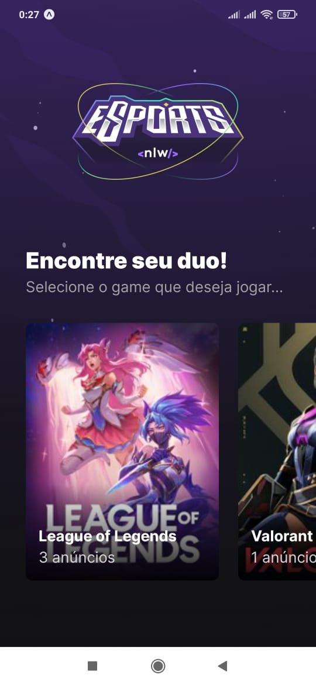
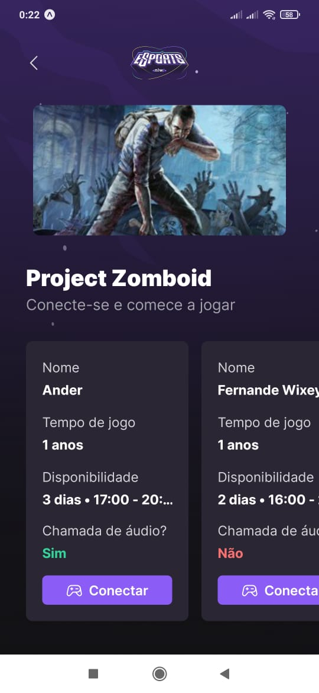
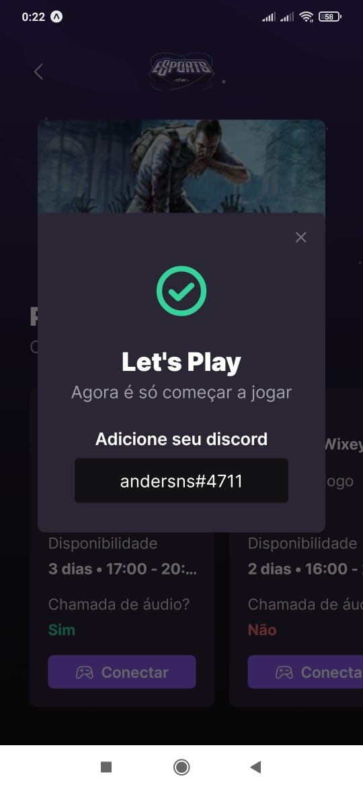

# NLW eSports - Trilha Ignite

Projeto desenvolvido na trilha Ignite durante a NLW eSports da Rocketseat.

  
   
  

## Tecnologias:

- Typescript

### Web
- React
- Tailwind CSS
- Vite
### Mobile
- React Native
- Expo
### Back-end
- Node.JS
- Express
- Prisma ( SQLite )

## TO DO's
- Tornar responsivo
- Adicionar listagem de mais jogos (keen-slider)
- Utilizar Select do Radix
- Validar Form Web (zod, react-hook-form)
- Autenticacao Web
- Adicionar Notificações
